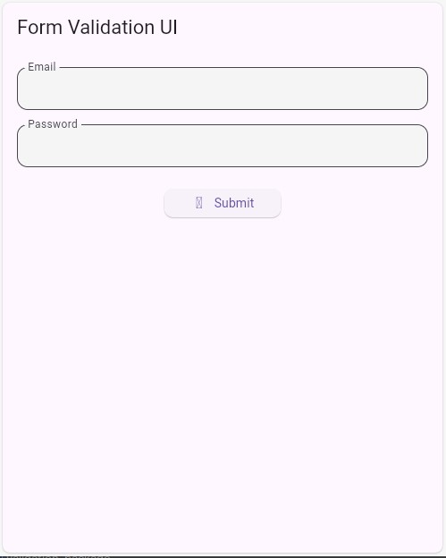
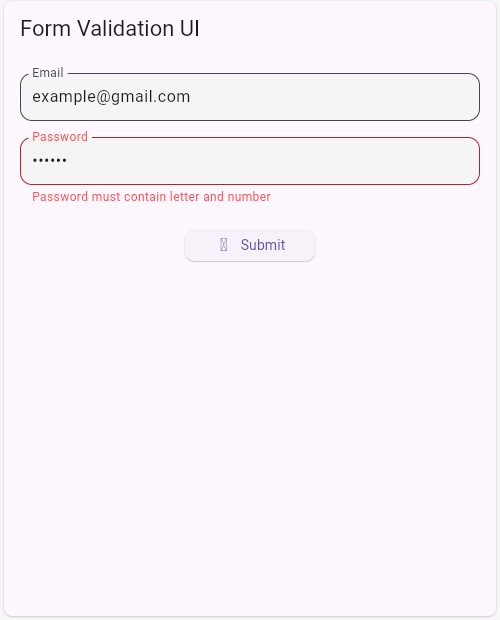
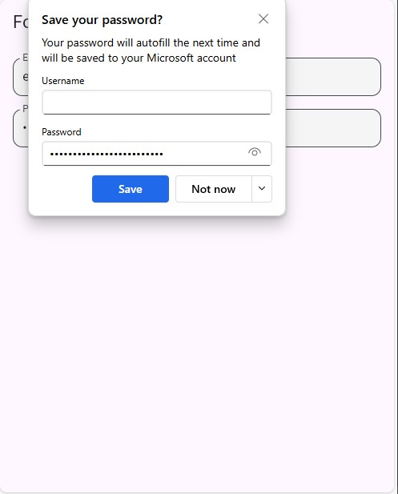

# Form Validation Package

A Flutter package that provides beautiful and customizable form validation widgets with built-in validation rules.

## Features

- Easy-to-use form validation widgets
- Built-in validation rules for common scenarios
- Customizable error messages and styling
- Beautiful UI components for form inputs

## Screenshots

### Password Validation


### Form Input States


### Save Password Dialog


## Installation

Add this to your package's `pubspec.yaml` file:

```yaml
dependencies:
  validation_package: ^0.0.1
```

## Usage

```dart
import 'package:validation_package/validation_package.dart';

// Create a validated text field with built-in validation
ValidatedTextField(
  label: 'Password',
  validator: PasswordValidator(),
  onChanged: (value) {
    // Handle text changes
  },
  onSubmitted: (value) {
    // Handle form submission
  },
);
```

## Validation Rules

The package comes with several built-in validators:

- Email validation
- Password validation (with customizable requirements)
- Required field validation
- Custom validation rules

## Contributing

Contributions are welcome! Please feel free to submit a Pull Request.

## License

This project is licensed under the MIT License - see the LICENSE file for details.